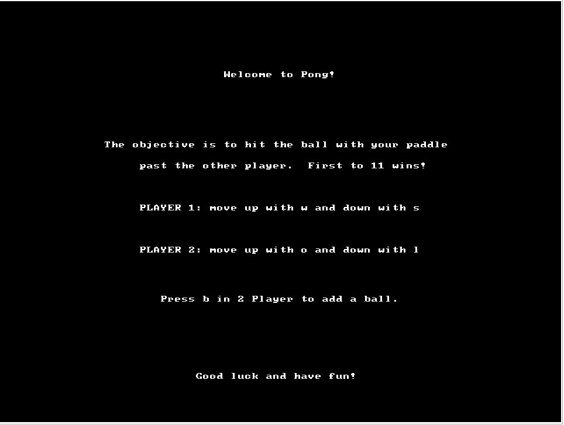

# Description
My partner [Joel Lotzkar](https://github.com/jlotzkar) and I chose to recreate Pong for our final ECE243 project. The game was written in C to work on the De1-SoC board using a VGA display and ps/2 keyboard. It can also work the [CPUlator](https://cpulator.01xz.net/?sys=arm-de1soc) simulator. Unfortunately we are requested by the course to not distribute our code, but I'd be happy to discuss it with anyone curious. However, photos of what the game looks like and how it works are described below. 

# The Game

You can select 3 options on the title screen. press H to get instructions, 2 to start 2-player mode, and 1 to start 1 player mode. In CPUlator, this would be achieved by typing into the ps/2 keyboard simulator with IRQ 79. 

Pressing H displays the following

Pressing H again takes you back to the main screen

